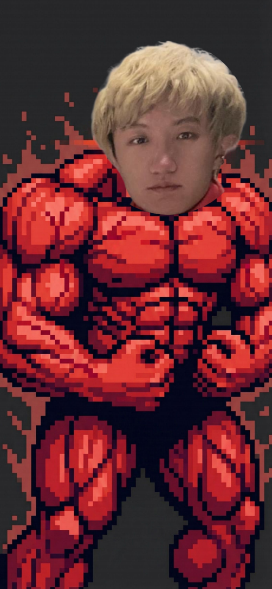

  

  
  
  
  
  
  

## ⚡ AI-Native & Agent Tools

- 💭 **[Mnemosyne](https://github.com/xinzhuwang-wxz/Mnemosyne)** — Memory is an **agent-native cognitive infrastructure**
- 🛡️ **[agent-memory-guard](https://github.com/xinzhuwang-wxz/agent-memory-guard)** — Scan AI agent memory for PII & secrets across 275+ patterns, with CI/CD integration
- 🧠 **[OpenPE](https://github.com/xinzhuwang-wxz/OpenPE)** — LLM-driven first-principles causal analysis: competing hypotheses, evidence testing, explanatory power tracking
- 🔭 **[Astro-Insight](https://github.com/xinzhuwang-wxz/Astro-Insight-official)** — AI astronomical research assistant with LangGraph + MCP for Q&A, retrieval & classification
- 💹 **[HolisticaQuant](https://github.com/xinzhuwang-wxz/HolisticaQuant)** — End-to-end trading system on LangGraph orchestrating planning, data & strategy agent teams
- 📚 **[idle-universe](https://github.com/xinzhuwang-wxz/idle-universe-code)** — LLM-powered RAG Q&A system with automated web scraping & Streamlit frontend
- 🎬 **[agency-brain](https://github.com/xinzhuwang-wxz/agency-brain)** — AI-powered risk and matching platform for Douyin MCN agencies
- 🖥️ **[mac-share](https://github.com/xinzhuwang-wxz/mac-share)** — One-click shared terminal for Mac mini with Tailscale mesh VPN
- 🗺️ **[code-understanding-system](https://github.com/xinzhuwang-wxz/code-understanding-system)** — Agent-native codebase understanding platform with MCP Server

## 🧩 Skills & Architecture

- 🛠️ **[agent-toolkit](https://github.com/xinzhuwang-wxz/agent-toolkit)** — provides the complete CLI and MCP Server infrastructure
- 🧱 **[coherent-fullstack-skill](https://github.com/xinzhuwang-wxz/coherent-fullstack-skill)** — Skill for writing fullstack code aligned across frontend, backend & database
- 🔬 **[scientific-codebase-distillation-skill](https://github.com/xinzhuwang-wxz/scientific-codebase-distillation)** — Skill for distilling methodology from codebases & papers
- 📖 **[paper-code-tutorial-skill](https://github.com/xinzhuwang-wxz/paper-code-tutorial-skill)** — Skill for turning papers & reference code into chapter-based bilingual visual tutorials

## 🔬 Physics & ML Research

- ⚡ **[Fusion-ParT](https://github.com/xinzhuwang-wxz/Fusion-ParT)** — Official implementation of Fusion-ParticleTransformer for jet physics
- 🌿 **[BambooHepMl](https://github.com/xinzhuwang-wxz/BambooHepMl)** — Config-driven ML workflow for HEP detector data: ROOT ingestion, declarative feature engineering
- 🔺 **[trihiggs_lorentznet_test_gpu](https://github.com/xinzhuwang-wxz/trihiggs_lorentznet_test_gpu)** — LorentzNet-based tri-Higgs event classification with GPU-accelerated training
- 🧪 **[Mol-HEP-Lab](https://github.com/ClawHep/Mol-HEP-Lab)** — Multi-agent autonomous HEP analysis platform with 5-phase pipeline
- 🐱 **[Purr-Sight](https://github.com/xinzhuwang-wxz/Purr-Sight)** — Multimodal ML classifying 8 pet behavioral fields from images & audio
- 🌐 **[EN-KO Transformer](https://github.com/xinzhuwang-wxz/English_Korean_translation_transformer)** — Transformer-based English-to-Korean neural machine translation
- 🎓 **[model-tutorial](https://github.com/xinzhuwang-wxz/model-tutorial)** — Hands-on tutorials walking through classic ML & deep learning model implementations

  

  <picture>
    <source media="(prefers-color-scheme: dark)" srcset="https://raw.githubusercontent.com/xinzhuwang-wxz/xinzhuwang-wxz/output/github-snake-dark.svg" />
    <source media="(prefers-color-scheme: light)" srcset="https://raw.githubusercontent.com/xinzhuwang-wxz/xinzhuwang-wxz/output/github-snake.svg" />
    
  </picture>

